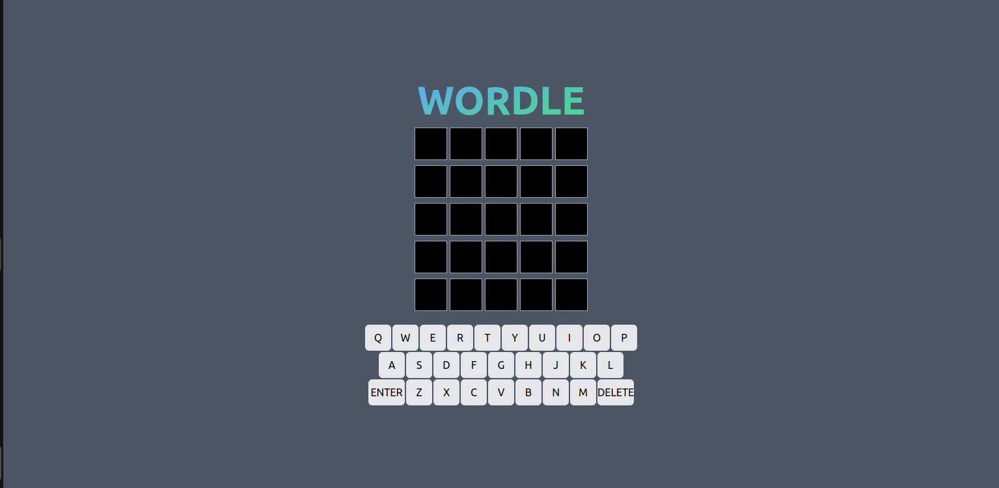
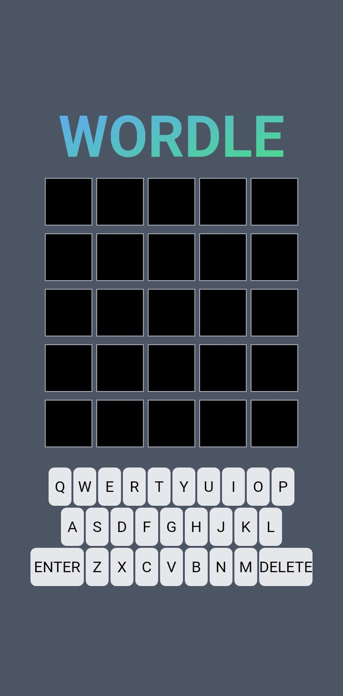

# wordle-game

A Wordle-inspired game built using ReactJS, CSS, and Tailwind CSS.

This game allows players to guess a word within a limited number of attempts, providing feedback on the correctness of each guess.

The game is designed to work seamlessly on both desktop and mobile devices.

The game is deployed on Vercel. You can view the live demo here: [Wordle Game Live](https://wordle-game-lilac.vercel.app/)

*Wordle game running on a desktop*

*Wordle game running on a mobile device*

## Features

- **Responsive Design**: The game is fully responsive, providing an optimal experience on both mobile and desktop devices.
- **State Management**: The game uses React's useState and Zustand for efficient state management.
- **Animations**: CSS animations are used to enhance the gameplay experience, such as the flip animation when revealing the letters.
- **Feedback System**: Players receive feedback on their guesses, indicating correct letters in the correct position, correct letters in the wrong position, and incorrect letters.

## Technologies Used

- **ReactJS**: For building the user interface and handling component-based architecture.
- **CSS**: For custom styling and animations.
- **Tailwind CSS**: For utility-first styling and responsive design adjustments.
- **Zustand**: For managing global state across the application.

## Getting Started

### Prerequisites

Make sure you have the following installed:
- Node.js
- npm or yarn

### Installation

Clone the repository:

git clone https://github.com/your-username/wordle-game.git
cd wordle-game

## Install the dependencies:

- bash
- Copy code
- npm install
- npm run dev

# or

- bash
- Copy code
- yarn install
- npm run dev

Open http://localhost:5173/ to view the game in the browser.

## Deployment

The game is deployed on Vercel. To deploy your own version, you can follow these steps:

1. Push your changes to a GitHub repository.
2. Link your repository to a new project on Vercel.
3. Vercel will automatically deploy your project and provide a live URL.

## How to Play
1. Enter a guess by typing a word or clicking the on-screen keyboard.
2. Press 'Enter' to submit your guess.
3. The game will provide feedback:
   - **Green** indicates a correct letter in the correct position.
   - **Yellow** indicates a correct letter in the wrong position.
   - **Red** indicates an incorrect letter.
4. Continue guessing until you find the correct word or run out of attempts.

## Contributing
Contributions are welcome! If you have suggestions for improvements or find any bugs, feel free to create an issue or submit a pull request.

## License
This project is licensed under the MIT License.

## Acknowledgements
Inspired by the popular Wordle game.
